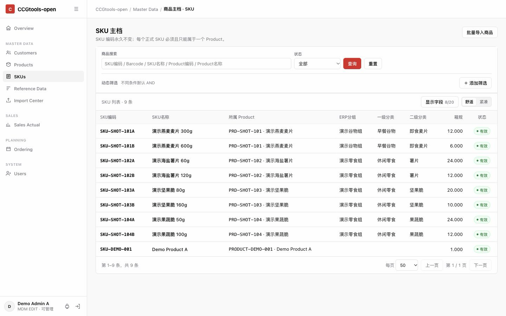
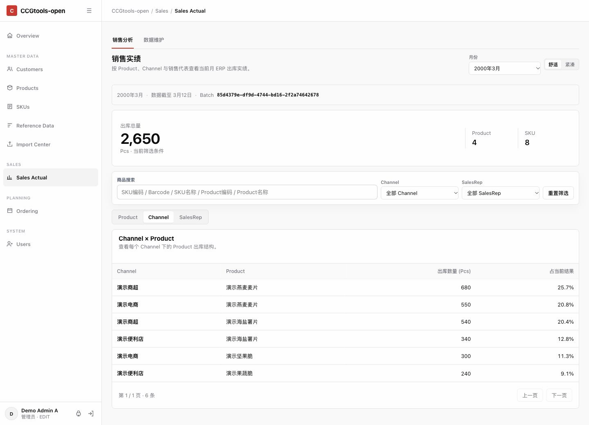
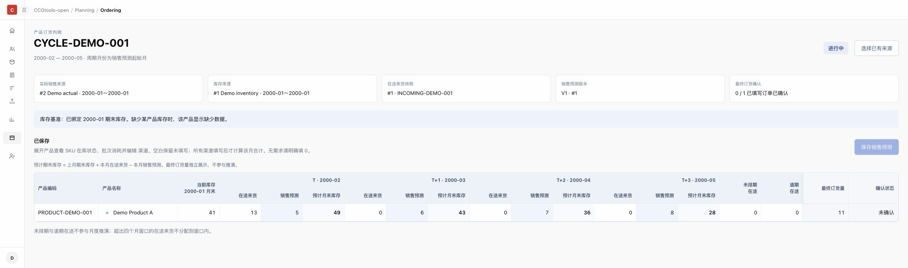

[English](README.md) | **[简体中文：项目介绍与 Demo 指南](README.zh-CN.md)**

# CCG WorkPanel

Shared Business Data Workspace for FMCG

**让分散的快消业务数据能够被共同理解与复用。**

Make fragmented FMCG business data understandable and reusable across teams and applications.
For Chinese industry visitors, start with the **[中文 README](README.zh-CN.md)**.

## Why This Project?

FMCG businesses generate large amounts of data every day.

Sales, inventory, customers, products, incoming supply, forecasts and orders are
spread across ERP systems, Excel files and tools used by different departments.
The practical challenge is often not a lack of data, but the difficulty of using
it together.

The same customer may have different names and codes in different systems. One
product may have several packaging variants and SKUs. Teams may also understand
channels, product categories and reporting definitions differently.

Every new report or business tool can mean organizing the same reference data
again and checking how the records relate.

**CCG WorkPanel explores how this fragmented data can be understood consistently
and reused across business applications.**

## What is CCG WorkPanel?

CCG WorkPanel is an open-source business data workspace built around master data
management (MDM).

It explores common definitions for customers, products, SKUs, channels and other
core business entities. Data mappings and explicit data contracts help relate
records from different sources so sales, inventory, forecasting and ordering
applications can use a shared foundation.

Our aim is not to replace ERP systems or ask departments to abandon their existing
tools. It is to establish reusable business data definitions between existing data
sources and applications.

To respect the security and access requirements of enterprise production systems,
the current public version uses file imports and an isolated local database to
explore this approach. All data provided for users to try is fictional and generated
from scratch. Files let users inspect records and confirm relationships, while
making data-processing rules reproducible to verify.

This is an open-source project under continued exploration, rather than a complete,
ready-to-use ERP or S&OP system.

## What Can You Do Today?

The public version can maintain shared reference data, display sales actuals, and
support ordering analysis using inventory, incoming supply and manual forecasts.
The table distinguishes browser-accessible features from service cores: existing
processing logic that still requires programmatic calls.

| Application | Business purpose | Current public support |
| --- | --- | --- |
| MDM and Import Center | Establish common customers, Products, SKUs and reference data | Browser and API: maintain master data, check customer, Product, SKU and combined goods files, then review and commit |
| Sales Actual (ACT Sales) | View actual sales quantities by product, channel, sales representative and other dimensions | Browser and API: sales file mapping, preview, publication and quantity dashboards |
| Inventory and Incoming Supply | Provide opening stock, eligible warehouses and incoming snapshots for planning | File parsing and commit service cores used by Demo initialization; no complete browser import workflow |
| Forecast | Enter four months of sales forecasts by channel and Product | Browser and API: view plans, select sources, edit and save forecast versions |
| Ordering | Compare inventory, incoming supply and forecasts; view final orders | Workbench displays four-month stock projections and final-order status; order writes, confirmation, revision history and planning-cycle locking have service cores without complete browser workflows |
| Portal, Auth and Permissions | Assign viewing, editing and account administration by role | Browser and API: permission-aware entry points, module viewing/editing permissions and account administration |

These applications use the same MDM customer, product and channel definitions,
while retaining distinct processing rules and versions. **ACT Sales dashboard
publication does not automatically create an Ordering sales source.** Ordering has
a separate sales actuals file import service. The data used for a plan must be
explicitly selected in its planning cycle, as explained below.

## Demo Screenshots

These screenshots come from isolated Public Demo instances using entirely fictional
Synthetic Data. The MDM and Sales data was prepared locally through existing workflows
for these screenshots and does not represent the default initialization counts;
Ordering shows the default Synthetic Demo's four-month plan.

### MDM

Manage Products and their SKUs together, with 5 Products and 9 SKUs shown.



### Sales Actual

View sales actuals by product and channel, with 3 channels, 4 Products and 2,650 Pcs shown.



### Ordering

Compare inventory, incoming supply and forecasts across a four-month planning window.

[](docs/assets/screenshots/ordering-forecast.png)

[Open the original Ordering PNG to view details](docs/assets/screenshots/ordering-forecast.png).

## Making Sense of Shared Data — MDM, Mapping and Data Contracts

Using records together starts with confirming which business entities they describe,
then checking that quantities and periods mean the same thing. MDM provides a common
foundation for those decisions.

A Customer may appear under a store nickname in a sales workbook and a legal billing
name in finance records, with different codes created independently by each system.
These differences can also represent distinct stores, legal entities or billing
relationships. Similar names alone are not enough to merge them.

Products have distinct levels. A **Product** groups related items for business
organization and reporting. A **SKU** identifies an individual specification,
packaging variant or material code. Multiple SKUs can belong to one Product, while
their codes, quantities and packaging relationships remain distinct.

MDM maintains these entities alongside channels, sales representatives and reference
data. Sales can reuse a customer's channel, inventory and incoming supply can reuse
the product directory, and forecasts and orders can use common product and channel
identifiers. Each application needs less repeated reference-data preparation.

**Unifying data does not require changing source systems.** Existing tools can keep
their names and codes. Imported files must follow the current adapter's format and
rules; the workspace records relationships and validation outcomes.

The customer and product relationships below are entirely fictional and created
from scratch. **They illustrate the design idea; they do not mean every current
adapter supports arbitrary source codes or alias mappings.** They are not bundled
Demo records.

| Fictional source records | Confirmed shared business relationship |
| --- | --- |
| Workbook A: `A-CUST-07`, Moonbud Store; workbook B: `B-CUST-42`, Moonbud Trading (example) | After business confirmation that they are the same customer, source mappings can link them to `CUS-EXAMPLE-01`; distinct stores or billing entities should retain separate records |
| `SKU-EXAMPLE-01`: Stargrain Cereal 300g; `SKU-EXAMPLE-02`: Stargrain Cereal 600g | Two distinct SKUs belong to Product `PRD-EXAMPLE-01`, Stargrain Cereal; aggregation follows the imported quantity and packaging contracts without assuming unit conversions |

Data contracts are the rules applications share when using data: required file
columns, quantity meaning, SKU-to-Product relationships, period coverage, eligible
warehouses, and commit or publication conditions. Inventory issues cannot replace
sales quantities. A blank is different from an explicit zero.

The current implementation retains these specific constraints:

- **Relationships:** the data model includes external-code mappings and aliases that the MDM import engine reads, without a general mapping-management UI. Current Sales mapping resolves SKUs by code with deterministic normalization, and customers by a unique normalized-name match to persisted MDM records. It does not guess business entities through fuzzy matching.
- **Import and publication:** master-data imports commit atomically as a batch, avoiding partially written results. Sales retains signed raw quantities; only eligible positive rows enter published facts.
- **Planning and history:** a Planning Cycle must explicitly adopt sales/inventory source versions, incoming snapshots and forecast versions. New files cannot silently replace selected data. Forecast versions are immutable, with changes saved as new versions; locked cycles preserve history.

The public version has no universal ERP API connector. Enterprise production
interfaces require authorization, source interface agreements and operational
support. See [Import contracts](docs/import-contracts.md) for detailed file formats
and processing rules.

## A Typical Business Workflow

1. **Establish shared definitions:** confirm customers, channels and Product-to-SKU relationships; validate and review master data through MDM and Import Center.
2. **Review sales actuals:** upload a fictional sales file that meets the current adapter contract, inspect mappings and preview, then publish the quantity dashboard.
3. **Prepare planning sources:** use existing services to import planning sales actuals, inventory and incoming supply. Demo seed prepares these sources for exploration; the browser does not yet cover all imports.
4. **Select versions and enter forecasts:** explicitly select the data versions used by the plan in the Ordering workbench, enter four months of manual forecasts by channel and Product, and inspect projected closing stock: Opening + Incoming − Forecast.
5. **Preserve decision history:** service cores support manual final orders, confirmation, revision history and cycle locking. Synthetic Demo and tests demonstrate these operations; they are not complete browser workflows.

This workflow illustrates data collaboration. It does not place orders into an ERP
or provide automatic demand forecasting.

## Try the Local Demo

### Docker Quick Start

Requires Docker with Compose. Run commands from the repository root:

```sh
docker compose -p ccgtools-open-demo -f deploy/local/compose.yml up --build -d --wait
```

Open <http://127.0.0.1:18080/login>. The isolated MySQL service binds only to
`127.0.0.1:13306` for local tests.

Initialization runs in this order:

1. Create the MySQL business schema from the public Alembic baseline.
2. Create the SQLite account schema.
3. Apply the account permission migration and verify its marker.
4. Seed synthetic accounts and their final permissions, then synthetic business data.
5. Start the application.

Startup and login recheck the applied account migration without resetting
permissions. No manual SQLite editing is required. App, seed and migrate use
the same local build image.

Environment overrides are described in [`.env.example`](deploy/local/.env.example).
Compose reads host environment values; it does not load that example file
automatically. See [Local development](docs/local-development.md).

### Three Demo Accounts

All three accounts use the password `demo-only-change-me`.
These credentials are for the loopback-only local demo.
Do not reuse them in any deployed environment.

| Account                         | MDM  | ACT Sales | Ordering / Forecast | User Management |
| ------------------------------- | ---- | --------- | ------------------- | --------------- |
| Demo Admin (`demo_admin`)       | EDIT | EDIT      | EDIT                | EDIT            |
| Demo Operator (`demo_operator`) | EDIT | EDIT      | EDIT                | NONE            |
| Demo Viewer (`demo_viewer`)     | VIEW | VIEW      | VIEW                | NONE            |

### Synthetic Data

`python3 -m demo.generate_data` reproducibly generates XLSX/CSV/JSON fixtures in
`webapp/tests/fixtures/synthetic/`. `python3 -m demo.seed` populates only an
explicitly enabled demo database. Host file generation requires project Python
dependencies; seeding additionally requires the isolated database setup in
[Local development](docs/local-development.md). Docker Quick Start already performs
initialization; no separate seed command is needed.

Names, codes, quantities and relationships are invented, not anonymized
business records. The demo uses a four-month planning window, explicit
warehouse availability and a configurable Sales decline gate
(`CCGTOOLS_SALES_DROP_THRESHOLD`, demo default `0.8`).


### Docker Reset

This deletes only this Compose project's fictional data volumes:

```sh
docker compose -p ccgtools-open-demo -f deploy/local/compose.yml down --volumes
docker compose -p ccgtools-open-demo -f deploy/local/compose.yml up --build -d --wait
```

## Technical Architecture and Tests

The browser uses plain HTML/CSS/JavaScript. `webapp/main.py` composes domain routers
with FastAPI. SQLite stores accounts and permissions; SQLAlchemy/MySQL stores
business and import data shared by MDM, Sales and Ordering.

Alembic has one public baseline, `0001_public_baseline`, including relational
constraints and triggers. Source versions are explicitly adopted into planning
cycles. Forecast versions are immutable; locked cycles preserve history and display
identity snapshots. No historical daily-reporting module is included.
See [Architecture](docs/architecture.md).

Run the existing test entry points from the repository root:

```sh
docker compose -p ccgtools-open-demo -f deploy/local/compose.yml run --rm tests
node --test webapp/tests/public_frontend_smoke.cjs
python3 -m demo.security_scan
```

Docker tests use Python `unittest` and project dependencies inside the image; start
the local Demo first. The last two commands require host Python 3 (with a `python3`
command) and Node.js supporting `node --test`; Node.js 18 or newer can be used.
The host security scan uses only Python's standard library. Python 3.12 is recommended
for host development and data tools needing project dependencies; Docker pins
Python 3.12.11. Host instructions use `python3` and do not require a `python` alias.

The tests cover empty SQLite initialization, account migrations and permissions,
MySQL schema/constraints/triggers, synthetic imports, sales publication,
forecasts/orders/locks, login, Portal and frontend contracts.
MySQL tests must not silently fall back to SQLite. The security scan checks public
content and synthetic workbook metadata.

## Current Limitations and Future Direction

- **Current scope:** the UI is primarily Chinese. File adapters document demo workbook formats, not universal ERP compatibility. Some inventory, incoming supply, ordering and locking operations have service cores without complete browser workflows.
- **Manual decisions:** forecasts and final-order quantities are supplied manually. The four-month forecast horizon is the current public contract.
- **Not supported today:** universal ERP API connections, real-time ERP synchronization, automatic source-system writeback or order placement, a general Semantic Layer, or automatic demand forecasting.
- **Future direction:** authorized data interfaces could extend reuse of shared entities, mappings and contracts. These are design directions, not implemented public features or delivery commitments.
- **Public Demo boundary:** use only loopback-local operation and synthetic data generated from scratch, without external business-system connections. This repository does not represent internal enterprise Production capabilities or deployment configuration. Contributions must exclude business exports, runtime databases, logs and operational credentials.
- **HTTP and cookies:** local HTTP defaults Cookie Secure to false. HTTPS installations must set `CCGTOOLS_PORTAL_COOKIE_SECURE=true`. HttpOnly and SameSite=Lax remain enabled. See [SECURITY.md](SECURITY.md) for further security guidance.

## Contributing and License

Contributions should address clear business needs and data contracts. Use only
synthetic data generated from scratch, keep changes focused, and run the local Demo,
tests and security scan under [Contributing](CONTRIBUTING.md). Schema, constraint,
trigger and transaction changes require isolated MySQL validation; SQLite cannot
establish MySQL compatibility. Frontend changes require interaction and permission checks.

License: Apache-2.0. See [LICENSE](LICENSE) for the full text.
